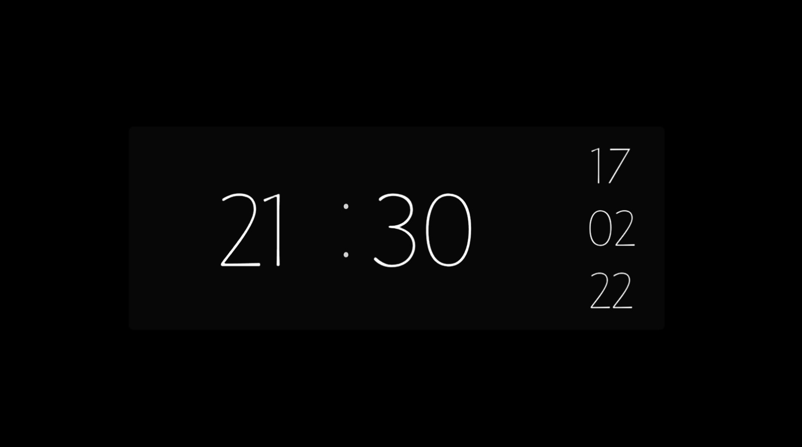
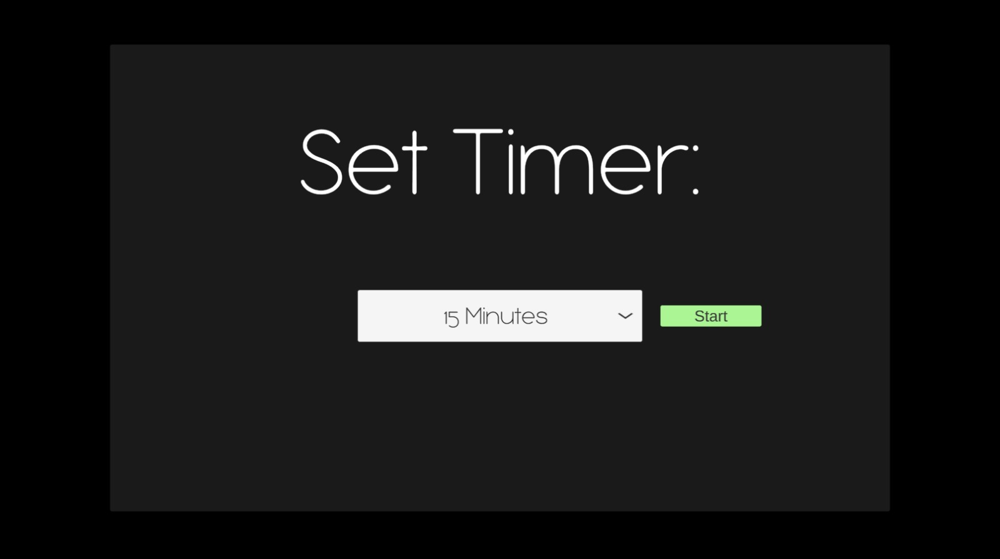
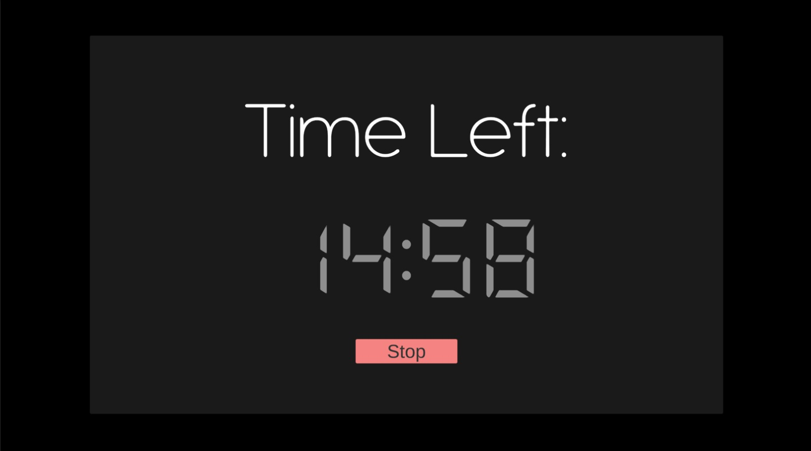

<h1 align="center">
  
  
 

  </h1>
<h3 align="center">  
  
  Simple Minimalistic & Prodctive clock program
  </h3>
  
## General

I was looking for a nice, minimalistic clock & timer windows FULLSCREEN application for my study sessions,  
The best that I found was a number of nice screensavers, but neither of them meets my requirements,so I decided to build one myself.

To use the program clone/download the [WindowsBuild](https://github.com/ArnonGuttel/minimalist-clock-desktop/tree/main/WindowsBuild) folder and run the minimal-clock.exe executable file
  
## Features

- Main Clock    
- Timer
- (future) Learning interval

## Hotkeys
- Double click on clock to toggle Fullscreen
- F4 to show/hide timer screen
- Click & hold on timer icon (will be desplayed when timer running) timer time remain popup

## Images

#### Main Clock:

 

 #### Timer:
 

  
  
 

## Credits 
- Font - florentiaThin
